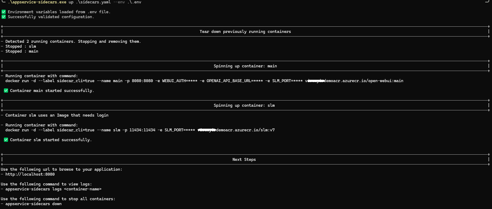
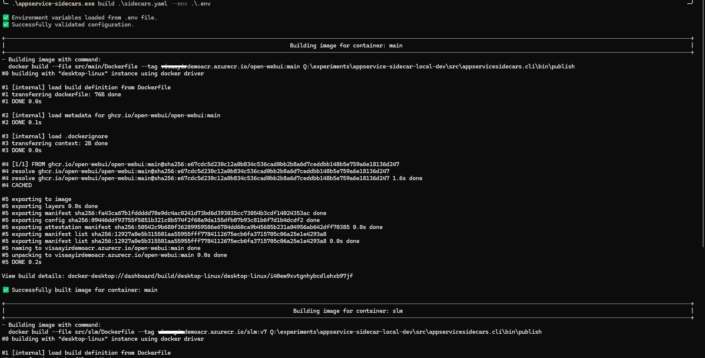

# AppService Sidecars CLI

## Overview

The AppService Sidecars CLI provides a seamless local developer experience for managing AppService sidecars. 
It offers commands to build containers, spin them up, and tear them down. 

The tool is designed with simplicity in mind, keeping the schema of sidecars.yaml closely aligned with docker-compose.yaml—while only incorporating features supported by App Services.

## Installation Steps

From the releases page, download the latest version of the CLI.

- [AppService Sidecars CLI Releases](https://github.com/vijaysaayi/app-service-sidecars-cli/releases)

For Linux, update the permissions to ensure it has execute permissions.

```bash
chmod +x appservice-sidecars
```

## Commands

### 1. `up`

The `up` command is used to spin up all containers defined in sidecars.yaml configuration file.

```bash
appservice-sidecars.exe up .\sidecars.yaml  --env .\.env
```



### 2. `down`

The `down` command stops and removes the sidecars created by appservice-sidecars cli.

```bash
appservice-sidecars.exe down
```

- Stops and removes the Docker containers associated with the sidecars.

### 3. `logs`

The `logs` command displays logs from the running sidecars.

```bash
appservice-sidecars.exe logs <containerName>
```

- Retrieves logs from the Docker containers associated with the sidecars.

### 4. `build`

The `build` command builds all containers specified in `sidecars.yaml`.

```bash
appservice-sidecars.exe build .\sidecars.yaml  --env .\.env
```



## Configuration

The CLI uses a `sidecars.yaml` file to define the sidecar configurations. 

### Example `sidecars.yaml`:

```yaml
version: v1

appsettings:
  - name: "WEBUI_AUTH"
    value: "false"
  
  - name: "OPENAI_API_BASE_URL"
    value: "http://localhost:11434/v1"

  - name: "SLM_PORT"
    value: "11434"

containers:
  # by default all environment variables are passed to main container.
  - name: "main"
    image: "ghcr.io/open-webui/open-webui:main"
    targetPort: "8080"
    isMain: true
    authType: Anonymous

    build:
      dockerfile: src\main\Dockerfile
      context: .

  - name: "slm"
    image: "demoacr.azurecr.io/phi-4-mini-instruct-q4_0:v6"
    targetPort: "11434"
    isMain: false
    authType: UserCredential
    userName: ${ACR_USERNAME}
    passwordSecret: ${ACR_PASSWORD}
    environmentVariables:
      - name: "SLM_PORT"
        value: "SLM_PORT"

    build:
      dockerfile: src\slm\Dockerfile
      context: .
      args:
        - test: ${VALUE}
```

You can also pass a `.env` file to the supported commands which will automatically replace variables in `sidecars.yaml`

```bash
ACR_USERNAME="your-acr-username"
ACR_PASSWORD="your-acr-password"
```

## Contributing

Contributions are welcome! Please fork the repository and submit a pull request.

## License

This project is licensed under the MIT License.
